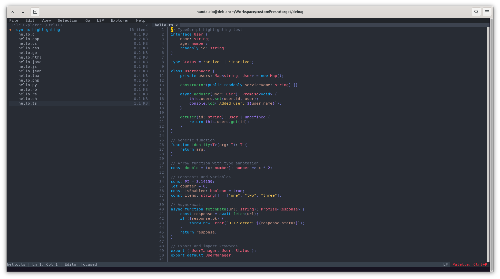
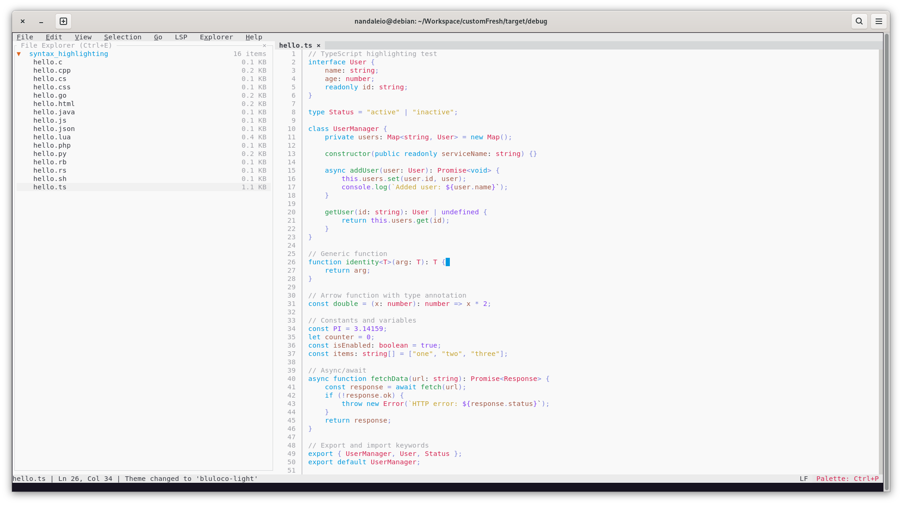

# bluloco-fresh
Bluloco theme for Fresh editor


# Bluloco Theme for Fresh Editor

A collection of Bluloco color scheme themes for [Fresh Editor](https://github.com/sinelaw/fresh/), featuring both dark and light theme.

## 📸 Screenshots

### Dark


### Light



## 📦 Installation

1. Locate your Fresh Editor themes directory (usually in the editor's configuration folder `.config/fresh/themes/`)
2. Copy the desired theme JSON file(s) to the themes directory
3. Restart Fresh Editor or reload the theme settings
4. Select the theme from the editor's theme picker

## 🎯 Color Palette

Each theme includes:

- **UI Colors**: Background, foreground, cursor, selection, panels, tabs, buttons, inputs, and more
- **Syntax Highlighting**: Comprehensive token colors for:
  - Comments (italicized)
  - Strings
  - Numbers
  - Keywords (bold)
  - Functions
  - Variables
  - Constants
  - Types and Classes
  - Interfaces
  - Properties
  - Tags and Attributes
  - Operators
  - Punctuation
  - Error/Warning/Info/Success indicators
  - Diff highlighting
  - Markdown syntax

## 🔧 Customization

If you need to adjust colors, edit the JSON file and modify the hex color values. The structure is:

```json
{
  "name": "bluloco-dark",
  "editor": {
    "bg": [40, 44, 52],
    "fg": [171, 178, 191],
    "cursor": [255, 204, 0],
    "inactive_cursor": [40, 44, 52],
    "current_line_bg": [45, 51, 61],
    "line_number_fg": [99, 109, 131],
    "line_number_bg": [40, 44, 52],
    "diff_add_bg": [43, 102, 63],
    "diff_remove_bg": [128, 52, 52],
    "diff_modify_bg": [54, 144, 255]
  },
  "ui": {
    "tab_active_fg": [171, 178, 191],
    "tab_active_bg": [45, 51, 61],
}
```

## 🌐 Resources

- [Bluloco dark GitHub](https://github.com/uloco/theme-bluloco-dark)
- [Bluloco light GitHub](https://github.com/uloco/theme-bluloco-light)

## 📄 License

These themes use the Bluloco color palette. Please refer to the Bluloco project for licensing information.